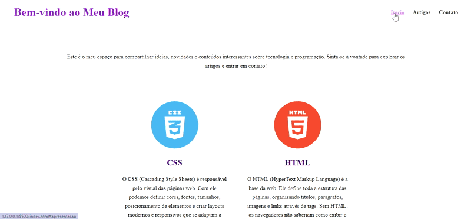

# 🌸 Meu Blog Acadêmico


**Um blog moderno feito com HTML e CSS, responsivo e pronto para exibir conteúdos de tecnologia.**

> ⚠️ **Atenção:** Este projeto foi desenvolvido **apenas como exercício acadêmico da faculdade**.

---

## 🚀 Tecnologias Utilizadas


> 💡 **Explicação:**
>
> * **HTML** → Estrutura da página
> * **CSS** → Estilo e layout, incluindo responsividade
> * **Git/GitHub** → Controle de versão e hospedagem do código

---

## ✨ Funcionalidades

* 🎯 Menu fixo com navegação interna
* 💜 Seção de apresentação com mensagem de boas-vindas
* 🖼️ Cards de artigos com **imagens circulares**
* ✉️ Formulário de contato estilizado
* 📱 Layout responsivo para **desktop e mobile**

---

## 📂 Estrutura do Projeto

```
meu-blog/
│
├── index.html        # Página principal
├── style.css         # Arquivo de estilo CSS
├── img/              # Pasta de imagens do blog
└── README.md         # Este arquivo
```

---

## 🎬 Demonstração Animada
  

---

## 🛠 Como Rodar o Projeto

1. Clone o repositório:

```bash
git clone https://github.com/seu-usuario/meu-blog.git
```

2. Abra o arquivo `index.html` no navegador.
3. Explore as seções e teste o formulário!


---

## 👩‍💻 Autora

**Manu Oliveira** – [Meu GitHub](https://github.com/seu-usuario)

---
